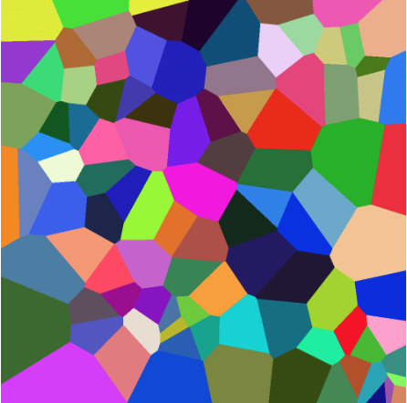

# Voronoi Diagram with C++

This repository contains implementations of creating and visualizing Voronoi-diagrams in C++ with OpenMP and OpenACC. 



## Requirements
This project needs to compiled first. Therefore it is necessary, that
- cmake
- make
- gcc

is installed. If you want to run the OpenACC implementation on the GPU, you may need to install CUDA and a GCC offload compiler. This code was tested on:
- Ubuntu 18.04
- Nvidia Drivers 430
- Cuda 10.2
- gcc-10 and gcc-10-offload-nvptx-none

## Getting Started
Compile OpenMP implementation

```
cd voronoi-diagram
mkdir build && cd build
cmake ..
make

./voronoi_diagram
```

Compile OpenACC implementation
```
cd voronoi-diagram
mkdir build && cd build
cmake -DUSE_OPENACC=ON ..
make

./voronoi_diagram
```

## Usage
```
Usage: ./voronoi_diagram<option(s)> SOURCESOptions:
        -h,--help               Show this help message
        -np,--npoints NPOINTS   Specify the amount of random points to be used. (default 100) 
        -pf,--pointFile POINTFILE       Specify path to a file with points defined. If this is used, then npoints wont be used.
        -h,--height HEIGHT      Specify height of the output image (default 1000)
        -w,--width WIDTH        Specify width of the output image (default 1000)
        -t,--type TYPE  Specify the calculation type. You can choose between SEQUENTIAL, OPENMP, OPENACC. Make sure that the app is compiled correctly. (default SEQUENTIAL)
```


